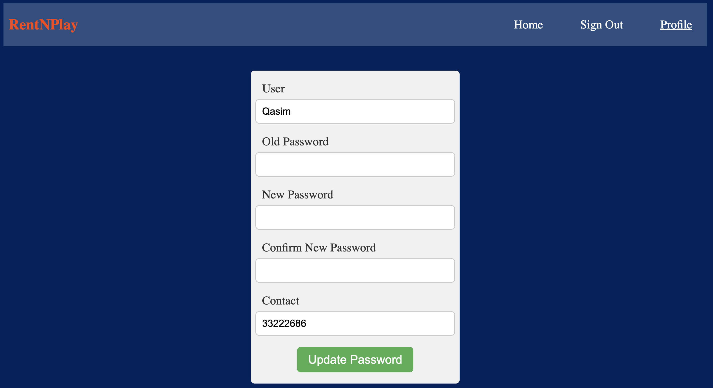

# ***RentNPlay*** 

## Date: 1/8/2024
### By: Qasim Alhamad

[Project Plan](https://trello.com/b/3optTgm1/rentnplay) | [GitHub](https://github.com/qassimalhamad/RentNPlay) | [Game](https://qassimalhamad.github.io/RaceToVictory/)

## Description
**RentNPlay** is an innovative platform designed to enhance the gaming experience by providing a seamless service for renting and purchasing video games.

## Technologies Used
* **JavaScript** 
* **EJS**
* **CSS**

## How It Works

1. **Sign Up**: Click on the **Sign Up** button to register as a new user and complete the registration form.
    
2. **Sign In**: After registration, sign in using the credentials you created.
    

3. **Browse Games**: Explore games available for sale or rent. You will see a list of games along with their price ranges.
    
4. **Add a Game**: Click on the **Add Game** button to list your game for sale or rent.
    
5. **My Games**: Access **My Games** to view all the games you have posted.
    
6. **Manage Listings**: Click on a game to edit details or delete the post.
    
7. **Profile Management**: Go to your profile to update your username, password, and contact information.
    
## Future Updates
- [ ] Users can upload images for their game listings.
- [ ] Added a back button to navigate to the previous page.
- [ ] CSS Upgrade.
- [ ] Categorization of games.
- [X] Edit Profile

## Useful Links
- [Images](https://gemini.google.com/)
- [Markdown Cheat-Sheet](https://www.markdownguide.org/cheat-sheet/)
- [Gradient Generator](https://cssgradient.io/)
- [CSS Design](https://getbootstrap.com/docs/5.0/components/navbar/)
